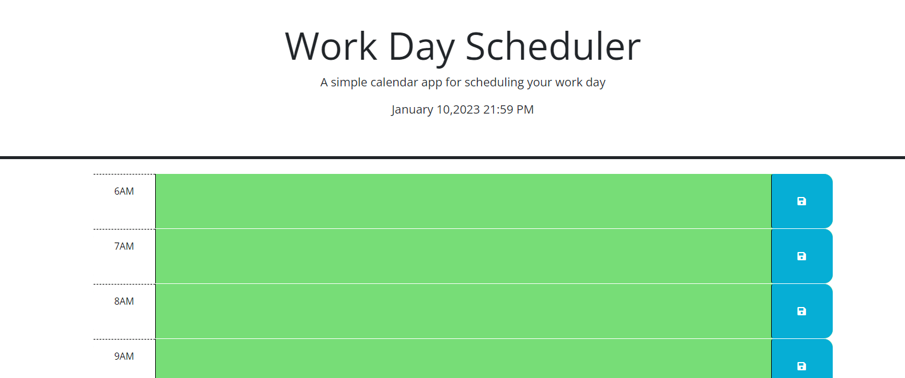

# Challenge5-Work-Day-Scheduler-3rd-Party-APIs

## Description
The challenge was to use the starter code and add JavaScript to the app to create an interactive work day scheduler. The criteria was as follows:

User Story
AS AN employee with a busy schedule
I WANT to add important events to a daily planner
SO THAT I can manage my time effectively
Acceptance Criteria
GIVEN I am using a daily planner to create a schedule
WHEN I open the planner
THEN the current day is displayed at the top of the calendar
WHEN I scroll down
THEN I am presented with timeblocks for standard business hours
WHEN I view the timeblocks for that day
THEN each timeblock is color coded to indicate whether it is in the past, present, or future
WHEN I click into a timeblock
THEN I can enter an event
WHEN I click the save button for that timeblock
THEN the text for that event is saved in local storage
WHEN I refresh the page
THEN the saved events persist

## Installation
No installation required

## Usage

[Github Page Address](https://tonyworldchanger.github.io/Challenge5-Work-Day-Scheduler-3rd-Party-APIs/)

 The scheduler will by typing anything in the time slots that the user needs to do for the day. Once complete, pressing the "save icon" button will save the information to your local storage. This will stay on the scheduler until deleted. The date at the top will stay current with the current day, date, and time. 

### ScreenShot of Challenge

## Credits
Dani Krossing Youtube
Jun Park Youtube
TA Cameron Verver
